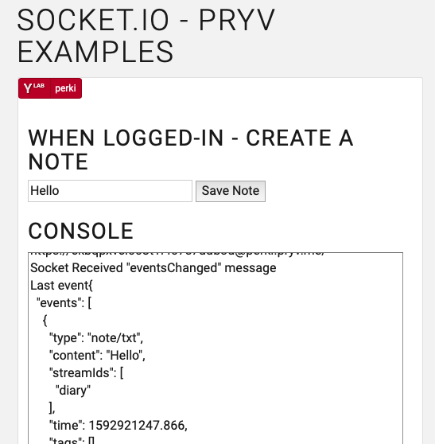

# Socket.io add-on for Pryv lib-js

Extends Pryv's [lib-js](https://github.com/pryv/lib-js) with socket.io transport and notifications.

## Setup

This library extends the `Pryv.Connection` class with a `connection.socket` property.

### Node.js

`npm install pryv @pryv/socket.io`

In you project files, load it **one time only**. The Pryv javascript package will be patched with socket.io capabilities.

```javascript
const Pryv = require('pryv');
require('@pryv/socket.io')(Pryv);
```

### Browser

Note: `pryv-socket.io.js` must be loaded **after** `pryv.js`


```html
<script src="https://api.pryv.com/lib-js/pryv.js"></script>
<script src="https://api.pryv.com/lib-js-socket.io/pryv-socket.io.js"></script>
```

#### Others distributions for browsers:

- ES6: `https://api.pryv.com/lib-js-socket.io/pryv-socket.io-es6.js` 
- Socket.io + Monitor + Lib-js: `https://api.pryv.com/lib-js/pryv-socket.io-monitor.js`. 


## Usage

Once Socket.io has been setup, `Pryv.Connection` instances expose the `.socket` property.

- `Connection.socket.open()` is an asynchronous call that opens the socket.io connection. It throws errors on failure.

- `Connection.socket.api()` is identical to `Connection.api()` using the socket.io transport [lib-js:API calls](https://github.com/pryv/lib-js#api-calls)

- `Connection.socket.on({event-name}, callback)` registers an event listener.

  Possible `event-name` values are:

  - `eventsChanged` :  Fired when one or multiples events are deleted, changed or added.
  - `streamsChanged`: Fired when one or multiples streams are deleted, changed or added.
  - `accessChanged`: Fired when an access is deleted or added.
  - `error`: Fired on error. The callback will eventually receive the error as first argument.

## Examples

### Node.js

```javascript
const Pryv = require('pryv');
require('@pryv/socket.io')(Pryv);

const apiEndpoint = 'https://{token}@my-computer.rec.la:4443/{username}/';
(async () => { 
  const conn = new Pryv.Connection(apiEndpoint);
  try {
    await conn.socket.open();
    conn.socket.on('eventsChanged', async () => {
      const res = await conn.socket.api([{method: 'events.get', params: {limit: 2}}]);
    	console.log('Last 2 events: ', JSON.stringify(res, null, 2));
    });
  } catch (e) {
    console.log('An error occured: ', e.message);
  }
})();
```

### Browser

```html
<script src="https://api.pryv.com/lib-js/pryv.js"></script>
<script src="https://api.pryv.com/lib-js-socket.io/pryv-socket.io.js"></script>

<script>
const apiEndpoint = 'https://{token}@my-computer.rec.la:4443/{username}/';
(async function () { 
  try {
    await conn.socket.open();
    conn.socket.on('eventsChanged', async () => {
      const res = await conn.socket.api([{method: 'events.get', params: {limit: 2}}]);
    	console.log('Last 2 events: ', JSON.stringify(res, null, 2));
    });
  } catch (e) {
    console.log('An error occured: ', e.message);
  }
})();
</script>
```

### Example web app



The `./examples/index.html` file is a simple demo app that allows to log in a Pryv.io platform, register to monitor events changes and create notes. 

It can be tested on [http://pryv.github.io/lib-js-socket.io](http://pryv.github.io/lib-js-socket.io) 

## Contribute

*Prerequisites*: Node 12

- Setup: `npm run setup`
- Build pryv.js library for browsers: `npm run build`, the result is published in `./dist`
- Node Tests: `npm run test`

